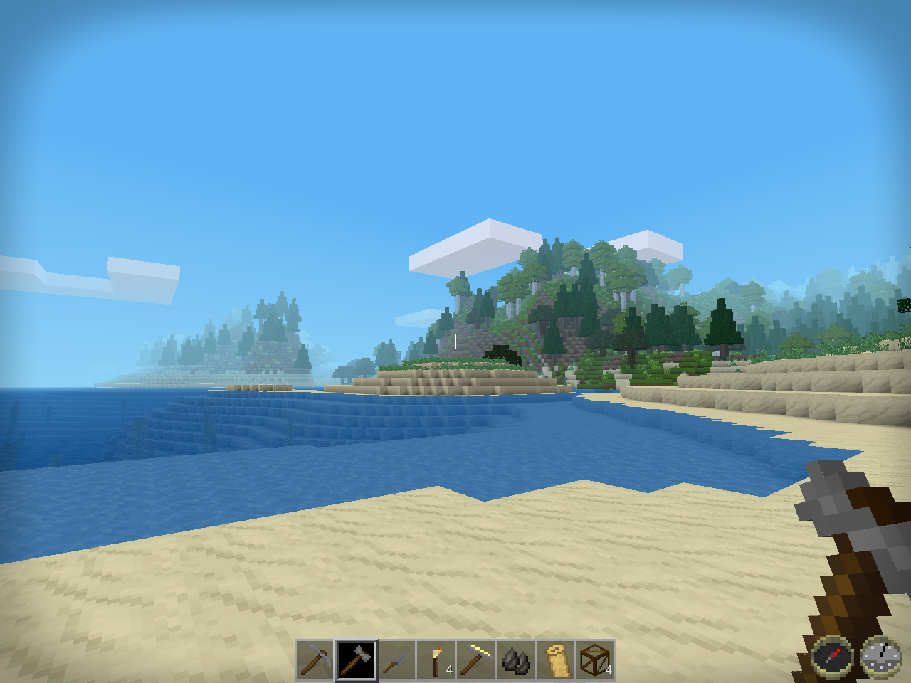

Vignette Redo
-------------

A Minetest mod to optionally place a vignette filter over the screen.

By David G (kestral246), based on the concept by TriBlade9.

How to enable
-------------

This mod defaults to not applying filter. To enable, use the chat command:

> "/vignette"

Repeated use of this command will toggle the effect off and on.

Local mod storage is used to maintain state of vignette filter between sessions, per user.

Licenses
--------
Source code

> The MIT License (MIT)

Media (textures)

>Attribution-ShareAlike 3.0 Unported (CC BY-SA 3.0)
 

